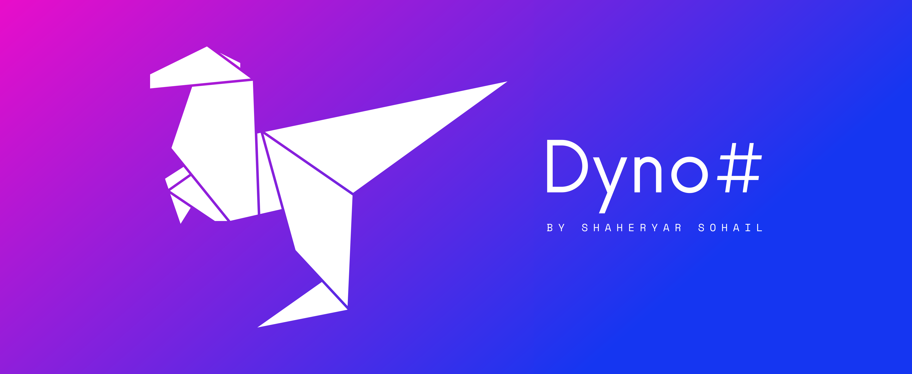

## Play Chrome's "No Internet" Dino Game using Computer Vision.

---

**Disclaimer:**

While all relevant code and project files are licensed under the MIT License, DynoSharp's cover image and/or logos are 
licensed under the Creative Commons Attribution-NonCommercial-NoDerivatives 4.0 International License. 

To view a copy of this license:
Visit http://creativecommons.org/licenses/by-nc-nd/4.0/ or send a letter to 
Creative Commons, PO Box 1866, Mountain View, CA 94042, USA.
